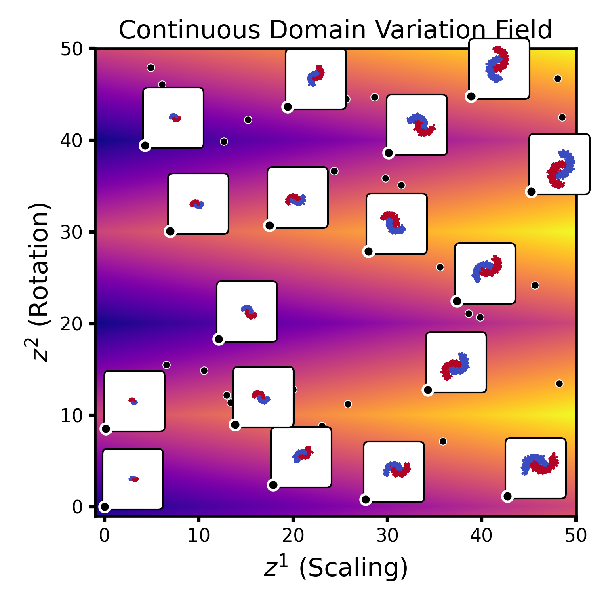
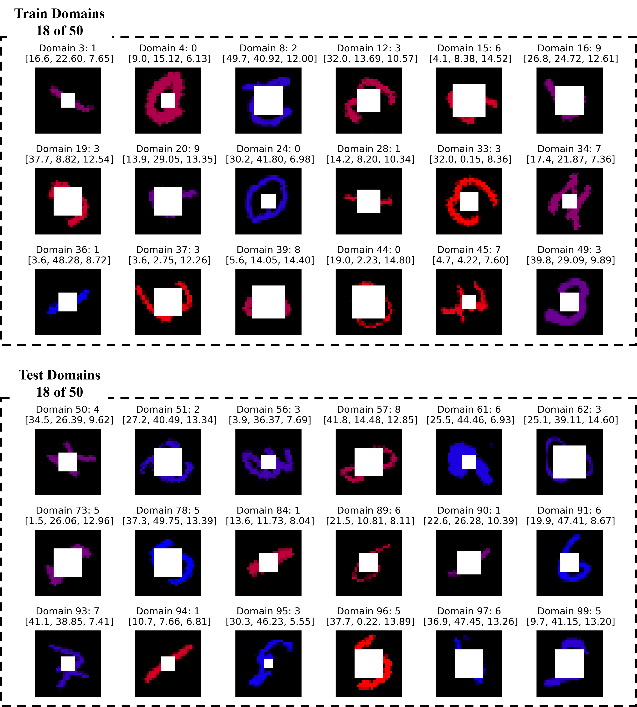

# This is the code for NeurIPS 2025 review.

# Jupyter Tutorial

We provide a Jupyter notebook tutorial ```NeuralLTO-Demo.ipynb``` in this repository. It offers a step-by-step guide to understanding our framework, demonstrating its core functionality on 2-Moons dataset.

**We also show how to reproduce and visualize the model parameter manifold via NeuralLTO.**

# Dataset Vis
<table>
  <tr>
    <td align="center">
      <br>
      <em>Figure 1: 2 Moons Dataset</em>
    </td>
    <td align="center">
      <br>
      <em>Figure 2: MNIST Dataset</em>
    </td>
  </tr>
</table>


# Parameter Manifold Result


<br>
<em>Figure 3: Parameter Manifold</em>
